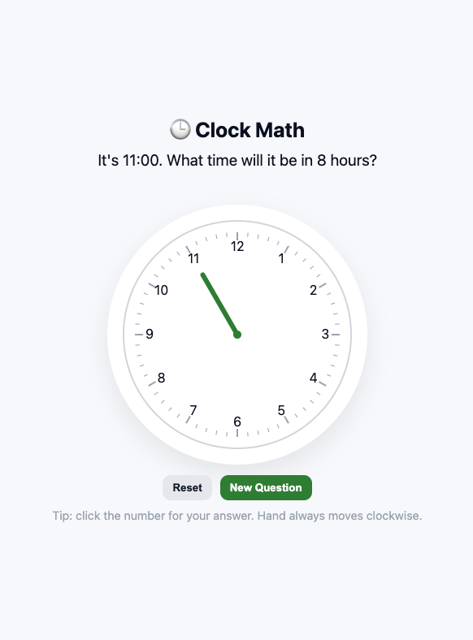
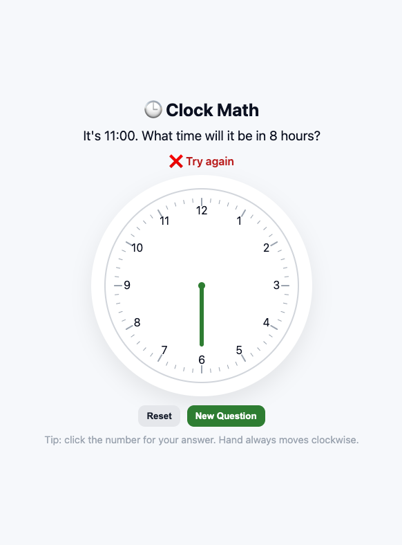
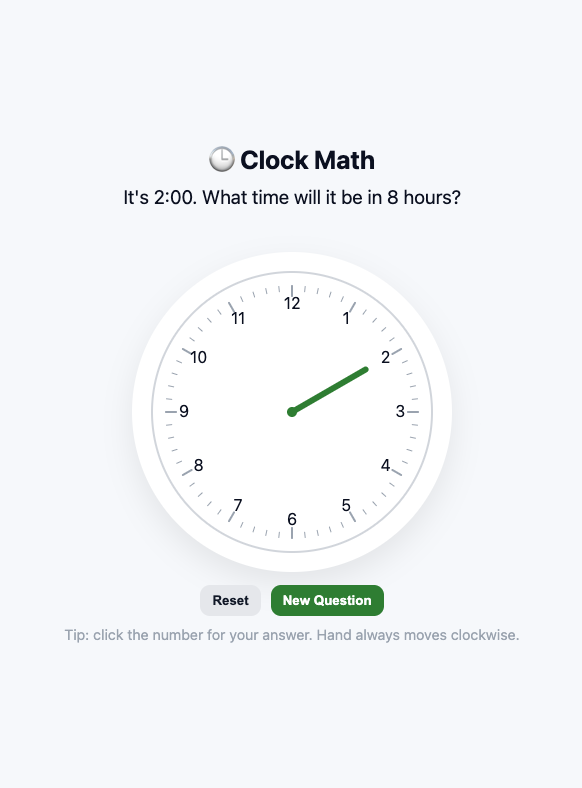

# Clock Math Game

A simple browser-based game that turns modular arithmetic into something visual and fun.  
Built in **vanilla HTML, CSS, and JavaScript** — no frameworks, no setup, just a file you can open in your browser.

## How It Works
- The game shows a clock face with numbers 1–12.
- A question appears:  
  *“It’s 3:00. What time will it be in 5 hours?”*
- Click the number on the clock where you think the hand should land.
- If you’re right ✅ the hour hand sweeps clockwise to the correct time.  
- If you’re wrong ❌ the hand still moves clockwise to your choice, and you can try again.  
- Buttons:  
  - **New Question** → generate a fresh problem.  
  - **Reset** → put the hand back to the start hour to try again.

## Quick Start
1. Download or clone this repo.  
2. Open `clockMath.html` in your browser (Chrome, Firefox, Safari, Edge all work).  
3. Start clicking on the clock to answer!

No installs, no build step — it’s pure front-end.

## Screenshots

Here’s the game in action:

## Play Online
This project works with **GitHub Pages**.  
Once Pages is enabled, the game will be live at: https://jenpal.github.io/clock-math-game/

## 🧩 Learning Connection
This game introduces the idea of **modular arithmetic** in a kid-friendly way:  
- Clocks wrap around after 12, just like numbers wrap around in mod 12.  
- Great for math learners who benefit from visual, interactive practice.

## ✨ Credits
Created by [Jennifer Pallister](https://www.linkedin.com/in/jennifer-pallister/)  
— AI applications & educational content specialist, parent, and occasional maker of games to entertain a math-curious kid.

---

💡 *Fork it, remix it, or use it as a starter template for your own math games.*

